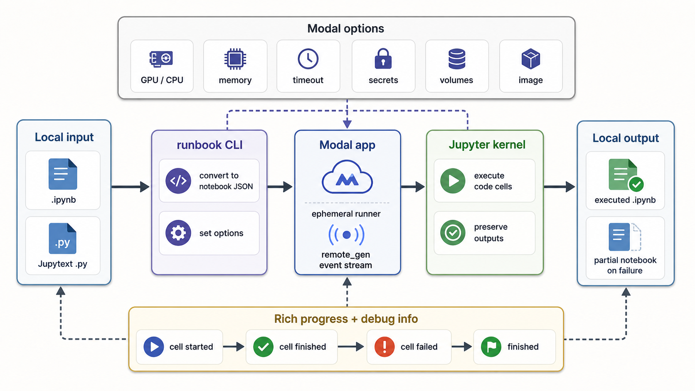

<div align="center">
  

  **📓 Execute notebooks on remote Modal compute 📓**
</div>

Runbook is a Python CLI that runs a local Jupyter notebook remotely on Modal and
writes notebook artifacts back to disk. While execution is active, outputs stream
into a `.running.ipynb` file. When the run ends, Runbook writes a
`.finished.ipynb` file and removes the `.running.ipynb` file. It supports native
`.ipynb` files and Jupytext `.py` percent notebooks.

Use it when a notebook needs Modal resources such as GPUs, larger CPU or memory
requests, secrets, volumes, or a custom registry image.

## Install

```bash
git clone https://github.com/tsilva/runbook.git
cd runbook
uv tool install . --editable
modal setup
```

Run the CLI from any shell:

```bash
runbook --help
```

## Commands

```bash
runbook input.ipynb --gpu A10 --timeout 7200 --output runs/output.ipynb
runbook analysis.py --output runs/analysis.ipynb
runbook input.ipynb --cpu 4 --memory 16384 --secret huggingface-token
runbook input.ipynb --volume model-cache:/models --kernel-name python3
runbook input.ipynb --allow-errors
runbook input.ipynb --mode serve
runbook input.ipynb --generate-requirements --dry-run
runbook input.ipynb --regenerate-requirements --dry-run
runbook input.ipynb --dry-run
runbook input.ipynb --python-version 3.12 --no-build-toolchain
python3 -m pytest  # run tests from a dev environment with pytest installed
```

CPU execution is the default when `--gpu` is omitted.

Runbook expects a companion execution requirements file next to the notebook:

```text
input.ipynb.yaml
```

If that file is missing, Runbook warns and exits without calling OpenRouter. The
warning includes the command to generate the file with the configured LLM:

```bash
runbook input.ipynb --generate-requirements --dry-run
```

When generation is explicitly requested, Runbook sends a full Jupytext dump of
the notebook to OpenRouter and asks a model to infer the Modal image, GPU,
packages, and runtime settings needed for remote execution. Runbook initializes
`~/.config/runbook`, prompts for an OpenRouter API key and model when needed,
and stores them in `~/.config/runbook/.env`. The default model is
`openai/gpt-5.5`. Later runs reuse the saved YAML file and do not call the model
unless `--generate-requirements` or `--regenerate-requirements` is passed.
Generated YAML records a source hash, so Runbook can reject stale requirements
after the notebook changes. CLI flags override values from the YAML file.

To run without a companion YAML, pass `--image` and any needed package flags
manually:

```bash
runbook input.ipynb --image python:3.11 --pip-package pandas --apt-package git
```

## Notes

- Execution happens inside one Modal container.
- Runbook starts one Jupyter kernel and executes code cells one by one, so state
  persists between cells.
- `--mode execute` is the default. `--mode serve` skips execution, starts
  JupyterLab in the Modal container, writes the notebook into the remote workdir,
  and prints a tokenized server URL that can be used from a browser or VS Code's
  existing Jupyter server flow.
- Cell outputs, rich display outputs, stdout/stderr, and tracebacks are
  preserved in the written notebook.
- During execution, Runbook writes live cell outputs and the current-cell pointer
  to `<output-base>.running.ipynb`; at the end it writes
  `<output-base>.finished.ipynb` and deletes the running file.
- By default, execution stops at the first cell error, writes the partial
  notebook, and exits nonzero.
- `--allow-errors` continues after cell errors and writes a completed notebook
  containing those errors.
- `--dry-run` resolves requirements and performs local preflight validation for
  the output path, Modal image definition, GPU request shape, secret references,
  and volume mount specs without executing the notebook.
- Executed notebooks include `metadata.runbook` with the resolved runtime,
  packages, Modal attachments, planner metadata, run status, and cell counts.
- Stdout/stderr and simple text display outputs are streamed while each cell is
  running, in addition to being preserved in the written notebook.
- The local notebook is uploaded as notebook JSON. Additional local data files
  are not uploaded; use Modal Volumes or bake data into the selected image.
- `--image` accepts a public registry image and adds Runbook's notebook
  execution dependencies plus packages from the companion YAML file.
- `--python-version`, `--build-toolchain/--no-build-toolchain`,
  `--pip-index-url`, and `--pip-extra-index-url` customize Modal image setup.

## Architecture



## License

MIT. See [LICENSE](./LICENSE).
